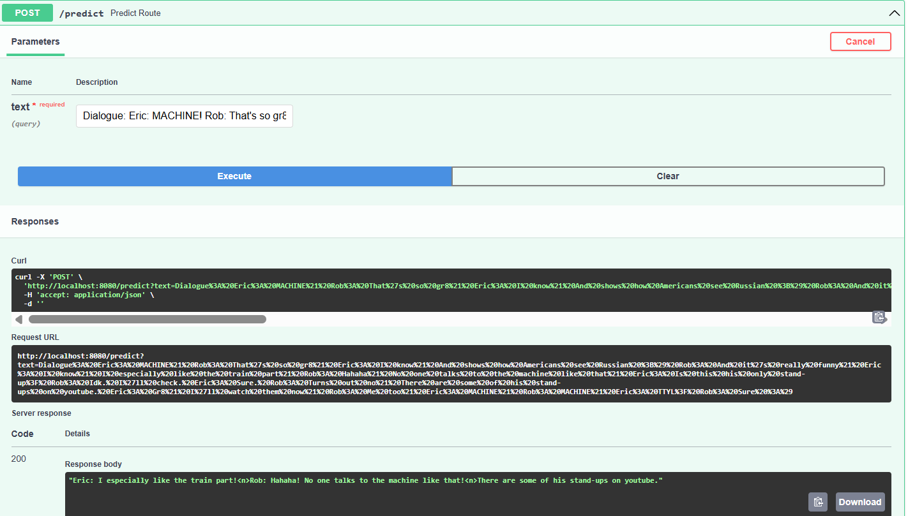

#  End-to-End Text Summarizer Project

This is an end-to-end implementation of a **Text Summarizer** using Natural Language Processing techniques and Transformer models. The project is structured in a modular fashion and includes setup for **local execution, Dockerization, and AWS CI/CD deployment using GitHub Actions**.

---

##  Project Structure & File Explanation

Below is a detailed breakdown of the project structure and the purpose of each file/folder. 

```
Text-Summarizer-Project/
│
├── .github/workflows/           # GitHub Actions workflows for CI/CD
│   └── main.yaml               # Workflow to deploy Docker image to AWS ECR and EC2
│
├── src/                         # All core Python modules for data processing and modeling
│   ├── config/                  # Configuration classes for reading YAML config
│   ├── components/              # Components for data ingestion, transformation, model training
│   ├── constants/               # Paths and constant definitions
│   ├── entity/                  # Entity definitions for structured configs
│   ├── logging/                 # Custom logger setup for debugging and info tracking
│   ├── pipeline/                # Pipeline orchestrators for training and prediction
│   └── utils/                   # Utility functions used across the project
│
├── app.py                       # Flask web app to interface with the model for summarization
├── main.py                      # Entry point to train and run the pipeline
├── config.yaml                  # Project configuration (paths, directories, URLs)
├── params.yaml                  # Model and tokenizer parameters
├── requirements.txt             # All Python dependencies
├── Dockerfile                   # Docker image setup
└── README.md                    # Project documentation
```

###  Explanation of Key Files and Folders

####  `config.yaml`
Contains paths for artifacts, model checkpoints, data sources, etc. It enables external configuration of project structure and helps avoid hardcoding file paths.

####  `params.yaml`
Holds parameters for tokenizer, training arguments, model selection (like BART, T5), max lengths, and batch sizes. Makes hyperparameter tuning easy and clean.

####  `src/config/`
Reads and parses values from `config.yaml` and `params.yaml` using classes. These configuration classes ensure clean data flow and modular pipeline creation.

#### `src/components/`
Core logic of the app:
- Data ingestion
- Data transformation
- Model training
- Model evaluation
- Model saving/loading

Each task is modularized into separate files.

####  `src/pipeline/`
Orchestrates the pipeline for training and prediction by calling appropriate components and passing configurations. It decouples business logic from orchestration.

####  `app.py`
This is the frontend of the project using Flask. It exposes a route (`/predict`) where the user can input long text and get the summarized output in real-time.

####  `main.py`
The main execution script that triggers the entire training pipeline, coordinating everything from data ingestion to model training.

####  `.github/workflows/main.yaml`
GitHub Actions CI/CD setup:
- Builds a Docker image on every `main` branch push
- Pushes it to AWS Elastic Container Registry (ECR)
- Pulls it onto EC2 for live deployment

---

##  Local Setup Instructions

### 1️ Clone the repository

```bash
git clone https://github.com/Bhavadharini-G/Text-Summarizer-Project
cd Text-Summarizer-Project
```

### 2️ Create a conda environment

```bash
conda create -n textS python=3.8 -y
conda activate textS
```

### 3️ Install requirements

```bash
pip install -r requirements.txt
```

### 4️ Run the Flask app

```bash
python app.py
```

Then open your browser and go to `https://locall.host/8080/`.

---


## AWS-CICD-Deployment-with-Github-Actions

### Login to AWS console.

1. Create an **IAM User** with:
   - `AmazonEC2ContainerRegistryFullAccess`
   - `AmazonEC2FullAccess`

2. Create an **ECR repository**  
   Example URI:  
   `866923973375.dkr.ecr.ap-south-1.amazonaws.com/text-s`

3. Launch an **EC2 instance (Ubuntu)**

4. Install Docker in EC2:

```bash
sudo apt-get update -y
sudo apt-get upgrade
curl -fsSL https://get.docker.com -o get-docker.sh
sudo sh get-docker.sh
sudo usermod -aG docker ubuntu
newgrp docker
```

5. Set up the EC2 instance as a **self-hosted GitHub Runner** via:
```
GitHub > Settings > Actions > Runners > self-hosted 
```

### GitHub Secrets Configuration

- `AWS_ACCESS_KEY_ID`
- `AWS_SECRET_ACCESS_KEY`
- `AWS_REGION`
- `AWS_ECR_LOGIN_URI`
- `ECR_REPOSITORY_NAME`

---

##  GitHub Actions Workflow (`.github/workflows/main.yaml`)

This file automates:
- Docker image build
- Login to ECR
- Push image to ECR

It allows seamless deployment whenever new code is pushed to `main`.

---
## Project Deployment
### Access via Public IP

Open your browser and visit: http://<your-ec2-public-ip>:8080

## Sample Output – Swagger UI

Below is the sample output from the FastAPI Swagger interface:




##  Author

**Bhavadharini G**  
Data Science Student, M.Tech  
gunasekaranbhavadharini@gmail.com  

---

##  License

This project is released under the [MIT License](LICENSE).

---
